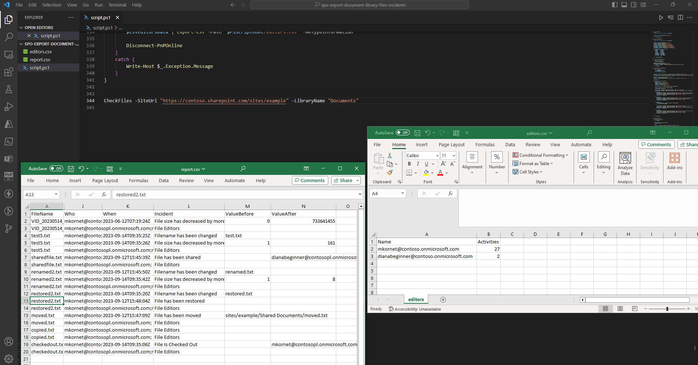

# Creation of FAQ page in SharePoint from excel source

## Summary
The script creates a SharePoint FAQ page using collapsible sections. 




# [CLI for Microsoft 365](#tab/cli-m365-ps)

```powershell
$m365Status = m365 status
if ($m365Status -match "Logged Out") {
    m365 login
}

$csvFilePath = "assets/FAQSetup.csv"
$webUrl = "https://1g044k.sharepoint.com/sites/BATTestSite"
$page = "test2.aspx"

$csvContent = Import-Csv -Path $csvFilePath
$index = 0
foreach ($row in $csvContent) {

    switch($row.BackgroundType) {
        "Gradient" {
            m365 spo page section add --pageName $page --webUrl $webUrl --sectionTemplate OneColumn --zoneEmphasis Gradient --gradientText $row.BackgroundDetails --isCollapsibleSection
        }
        "Image" {
            m365 spo page section add --pageName $page --webUrl $webUrl --sectionTemplate OneColumn --zoneEmphasis Image --imageUrl "https://contoso.com/image.jpg" --zoneEmphasis Image --fillMode Tile --isCollapsibleSection
        }
        Default {
             m365 spo page section add --pageName $page --webUrl $webUrl --sectionTemplate OneColumn --zoneEmphasis $row.BackgroundType --isCollapsibleSection
        }
    }
    m365 spo page text add --pageName $page --webUrl $webUrl --text $row.Answer --section $index
    $index++
}


#Disconnect SharePoint online connection
m365 logout
```

[!INCLUDE [More about CLI for Microsoft 365](../../docfx/includes/MORE-CLIM365.md)]

***


## Source Credit

Sample first appeared on [https://michalkornet.com/2023/09/19/Report-of-SharePoint-Files-Incidents.html](https://michalkornet.com/2023/09/19/Report-of-SharePoint-Files-Incidents.html)

## Contributors

| Author(s)                                 |
| ----------------------------------------- |
| [Michał Kornet](https://github.com/mkm17) |


[!INCLUDE [DISCLAIMER](../../docfx/includes/DISCLAIMER.md)]
